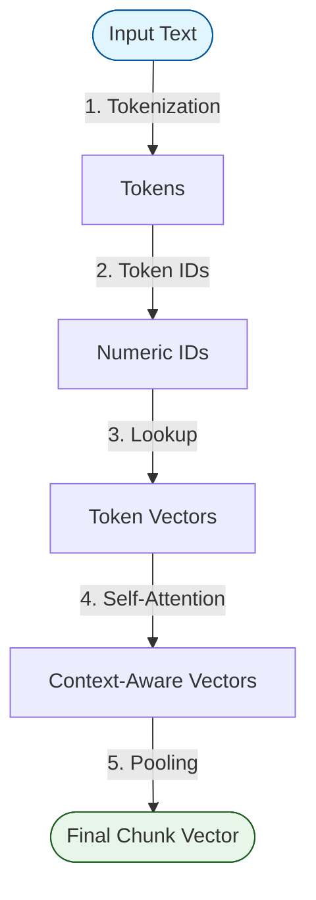

# Day 5: Text to Numbers Pipeline 🔢

How exactly does a string of text become an array of numbers (embeddings)? It follows a precise 5-step pipeline.

## 🔀 The 5-Step Pipeline

### Step 1: Tokenization ✂️

- **Action**: A sentence is chopped up into small pieces called **tokens**.
- **Result**: Small sub-word segments like `['The', ' run', 'ning', ' dog']`.

### Step 2: Token IDs 🏷

- **Action**: Each unique token is mapped to a numeric ID from a massive dictionary.
- **Result**: `['The': 102, ' run': 455, 'ning': 12, ' dog': 99]`

### Step 3: Token Vectors 📐

- **Action**: Each ID retrieves a "dense vector" from an embedding matrix (often 768 to 1536 dimensions). At this stage, the word "bank" always gets the same vector, regardless of context.

### Step 4: Self-Attention 🗣

- **Action**: Each word "looks" at surrounding words. The vector for "bank" is mathematically adjusted based on words like "river" or "money".
- **Result**: Context-aware meaning.

### Step 5: Pooling 🌊

- **Action**: The many contextual token vectors are mathematically combined (averaged or maxed) into one single vector representation.
- **Result**: One embedding vector for the entire chunk!
