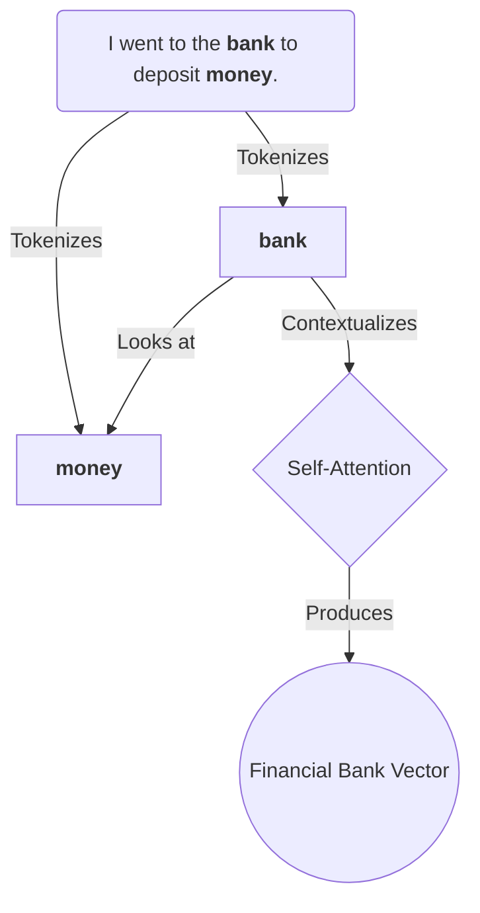
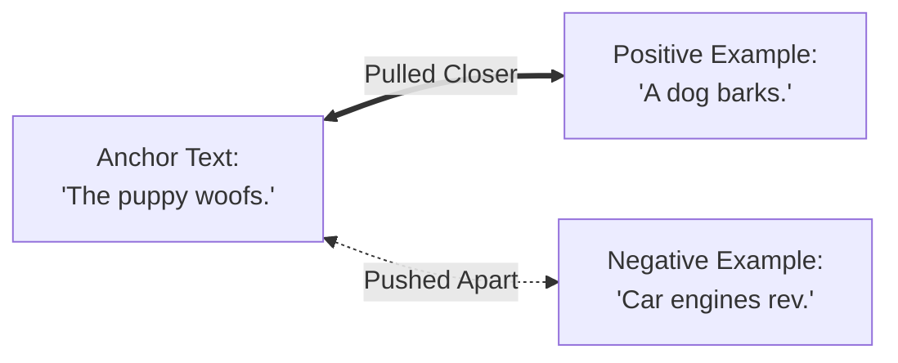

# Day 5: Self-Attention & Contrastive Learning 🧠

Let's demystify two core machine learning concepts that make embeddings "smart".

## 1. What Self-Attention Does 🔦

Self-attention allows words to understand their surrounding neighbors.

- Each word calculates an "importance score" (attention weight) across all other words in the chunk.
- Thus, the same word can have an entirely different final vector in a different sentence, making the embedding **context-aware**.

## 2. How Embedding Models Are Trained 🏋️

Contrastive Learning is the secret sauce for training embedding models. It teaches the model the concepts of "similarity" and "difference".

- **Positives**: The model is fed two sentences that mean the same thing. It updates its weights to **pull** their resulting vectors closer together.
- **Negatives**: The model is fed unrelated sentences. It **pushes** their vectors apart.
- **Result**: It learns semantic geometry. Sentences describing cars group together in space, far removed from sentences describing dogs.
