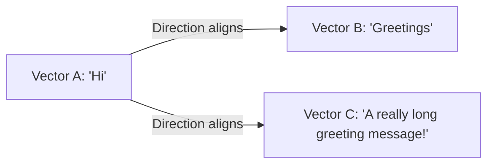
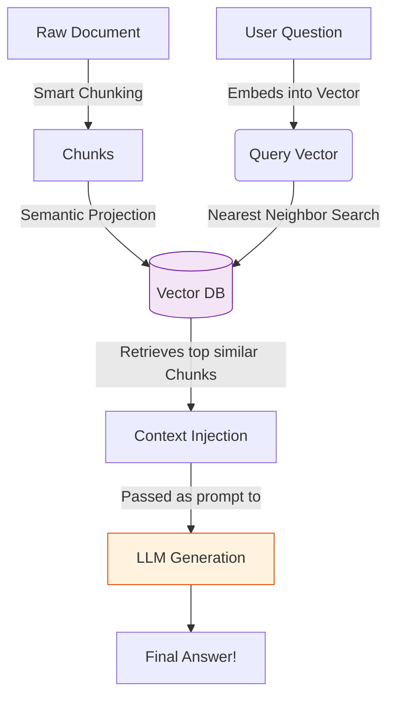

# Day 5: Similarity Metrics & Core Mental Model 🪐

Once our text is safely transformed into numerical vectors, how do we use them? We search them using geometry.

## 1. Why Cosine Similarity? 📐

If we want to find out how similar two text chunks are, we compare their vectors.

- **Euclidean Distance**: Measures physical straight-line distance. It is sensitive to vector length (e.g., how long the sentence is).
- **Cosine Similarity**: Measures the _angle_ (direction) between two vectors.

- **The Rule**: In embedding space, **Direction = Meaning**.
- Two vectors pointing in the exact same direction have a Cosine Similarity of `1`. Opposite directions = `-1`.

## 2. The Core Mental Model of RAG ⚙️

RAG is less about matching keywords, and more about finding the nearest conceptual neighbor.

### The 3 Core Pillars:

1. **Language becomes Geometry**: Words translate into high-dimensional points.
2. **Meaning becomes Distance**: Similar ideas are mathematically closer together.
3. **Retrieval becomes Search**: RAG simply queries the closest "Meaning" points to your question.
