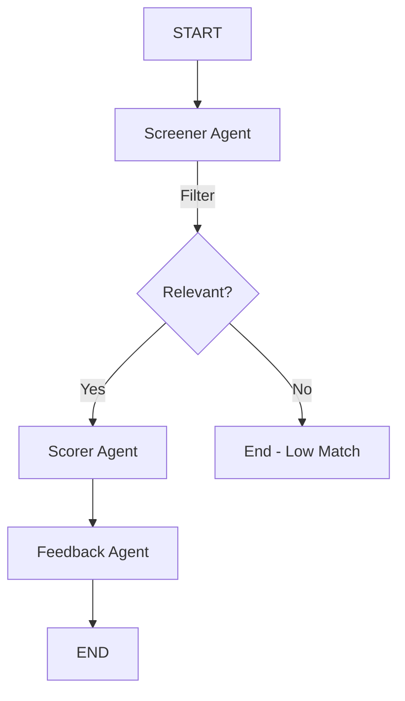

# Day 19: Multi-Agent Resume Screener

## 🎯 Project Overview
Building a high-performance Resume Screener using a multi-agent architecture. This system takes a Job Description (JD) and a Resume PDF, processes them through a pipeline of specialized agents, and provides a structured evaluation.

### What it does
- **Input:** Job Description + Resume PDF
- **Output:** Screen result + Score + Detailed Feedback

---

## 🏗️ Architecture — 3 Agents, 1 Pipeline



### The 3 Agents
1. **Screener Agent:** Is this resume even relevant to the JD? (Hard filter — saves cost)
2. **Scorer Agent:** Score 0-100 across 5 dimensions.
3. **Feedback Agent:** Write detailed human-readable feedback.

---

## 📊 The 5 Scoring Dimensions
1. **Skills Match** — Does candidate have required skills?
2. **Experience Level** — Years + seniority match?
3. **Education** — Degree relevance.
4. **Project Relevance** — Past work similar to role?
5. **Overall Fit** — Gut score.

---

## 🛠️ Technology Stack

| Tool | Role |
|------|------|
| **LangGraph** | Orchestrates 3 agents as a pipeline |
| **OpenRouter** | LLM calls inside each agent |
| **Qdrant** | Store resume embeddings — find similar past candidates |
| **FastAPI** | `/screen` endpoint — accepts JD + resume, returns result |

---

## 📁 Folder Structure
```text
resume-screener/
├── agents/
│   ├── screener.py      # Agent 1: Relevancy Check
│   ├── scorer.py        # Agent 2: Dimension Scoring
│   └── feedback.py      # Agent 3: Detailed Feedback
├── graph/
│   └── pipeline.py      # LangGraph wiring
├── api/
│   └── main.py          # FastAPI endpoints
├── vectorstore/
│   └── qdrant.py        # Store + search resumes
├── main.py              # Entry point
└── README.md
```

---

## 🗓️ Day-by-Day Plan

### Day 1 — Core Pipeline
- Build `AgentState`
- Build all 3 agents (Screener, Scorer, Feedback)
- Wire LangGraph graph
- Test with dummy JD + resume

### Day 2 — Full Stack
- Add Qdrant — store each screened resume as embedding
- Add similarity search — "find me resumes similar to this one"
- Wrap everything in FastAPI

### Day 3 — Polish
- Test with 5 real resumes + JDs
- Clean up output format
- Write README with architecture diagram
- Record a demo video for LinkedIn

---

## 💻 AgentState Design
```python
class AgentState(TypedDict):
    jd: str                  # Job description
    resume: str              # Parsed resume text
    is_relevant: bool        # Screener decision
    scores: dict             # Scorer output
    feedback: str            # Feedback agent output
    final_report: dict       # Combined final output
```
